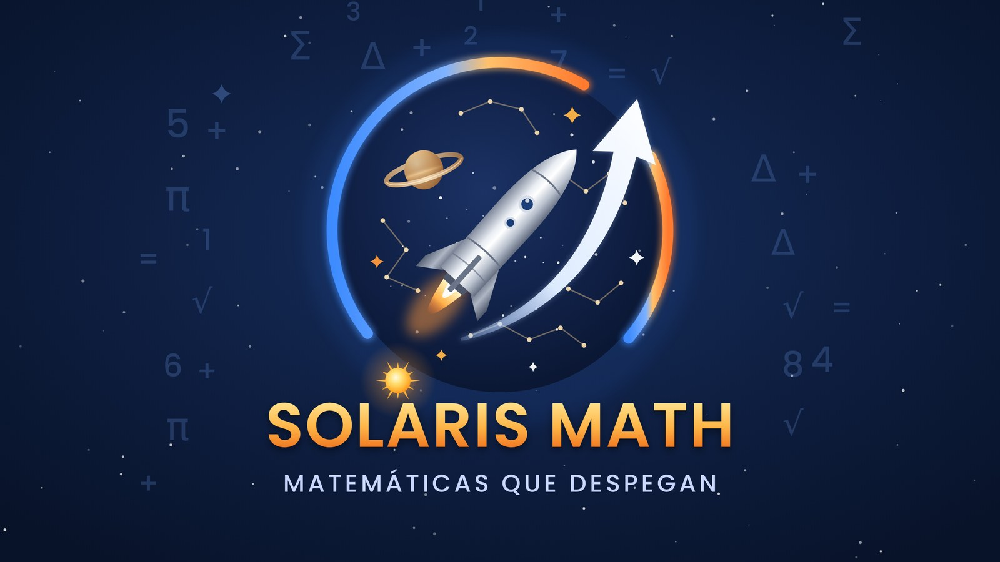
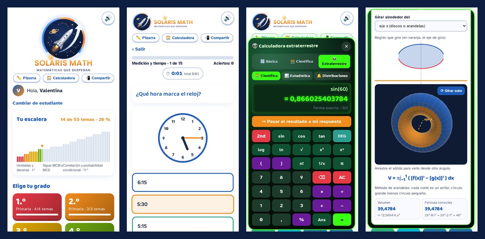
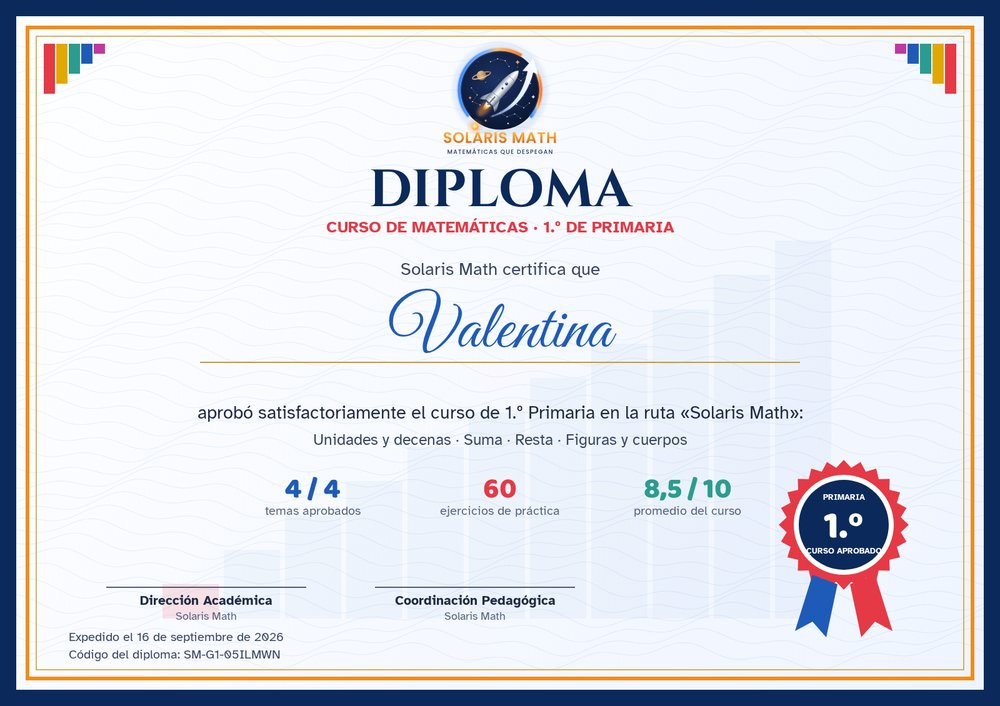

  

<h1 align="center">Solaris Math</h1>

<b>Matemáticas que despegan</b> · Math that takes off

  <a href="https://ttonguinon.github.io/solaris-math/"><b>🚀 Abrir la app</b></a> ·
  <a href="https://ttonguinon.github.io/solaris-math/demo.html">Demostración</a> ·
  <a href="https://ttonguinon.github.io/solaris-math/presentacion.html">Presentación (2 min)</a> ·
  <a href="https://ttonguinon.github.io/solaris-math/intro.html">Intro video (EN)</a>

---

**Solaris Math** es una aplicación web para aprender matemáticas de **1.º a 11.º grado**, paso a paso y al ritmo de cada estudiante. Funciona en el navegador de cualquier celular o computador, se puede instalar como aplicación, trabaja sin conexión y no tiene publicidad.

## Qué incluye

- **53 temas de 1.º a 11.º**, relacionados con los Estándares Básicos de Competencias y con 92 de los 116 Derechos Básicos de Aprendizaje (DBA) del Ministerio de Educación Nacional.
- **Ruta en forma de escalera:**
  - Cada tema se aprueba con 9 de 15 respuestas correctas y abre el siguiente.
  - Una **prueba de ubicación** permite empezar en el nivel del estudiante.
- **Lecciones completas:**
  - Cinco partes: qué es, paso a paso, ejemplo resuelto, vida real y error común.
  - Dibujos interactivos para explorar.
  - Referentes del MEN en cada tema.
- **Práctica que enseña:**
  - 15 ejercicios generados al azar en cada ronda.
  - Solución paso a paso de cada error.
  - Reloj, récords, sonidos y guía de estudio en PDF por tema.
- **Herramientas:**
  - **Pizarra** a pantalla completa.
  - **Calculadora de tres niveles:** básica, científica y 👽 extraterrestre, con derivadas simbólicas con pasos, gráficas, sólidos de revolución en 3D, distribuciones de probabilidad, ecuaciones y bases numéricas.
- **Diplomas:** uno por cada grado aprobado y uno por la ruta completa.
- **Privacidad:** el estudiante solo usa un apodo, y el avance se guarda en su propio dispositivo.
- **Nube opcional:** el colegio puede conectar la app a Google Sheets para ver el avance del grupo (ver [`nube/`](nube/)).

## Estructura del repositorio

| Archivo o carpeta | Contenido |
|---|---|
| `index.html` | La app completa |
| `demo.html` | Versión de demostración (1.º a 3.º) |
| `presentacion.html` | Presentación animada de 2 minutos, en español |
| `intro.html` | Video introductorio de 1 minuto, en inglés |
| `manifest.json`, `sw.js` | Instalación como app y funcionamiento sin conexión |
| `icon-192.png`, `icon-512.png`, `icon-maskable-512.png` | Íconos de la app |
| `marca/` | Logos de Solaris Math (SVG y PNG) |
| `nube/` | Servidor opcional para Google Sheets (`Code.gs`) y su guía |
| `assets/` | Imágenes de este README |
| `.nojekyll` | Indica a GitHub Pages que publique los archivos tal cual |

Cada página HTML es un solo archivo, sin dependencias que instalar.

## Publicar en GitHub Pages

1. Sube todos los archivos a la rama `main`, en la raíz del repositorio.
2. En **Settings → Pages**, elige **Deploy from a branch**, la rama **main** y la carpeta **/ (root)**, y guarda.
3. En uno o dos minutos la app queda en `https://ttonguinon.github.io/solaris-math/`.

## Actualizar

Sube el archivo nuevo (por ejemplo, `index.html`) con **Add file → Upload files → Commit changes**. Los estudiantes reciben la nueva versión la próxima vez que abran la app con internet.

Si cambias los íconos o `sw.js`, sube el número de versión dentro de `sw.js` (`solaris-math-v2` → `solaris-math-v3`).

## Nube con Google Sheets (opcional)

Sin configurar nada, cada estudiante guarda su avance en su dispositivo. Para ver el avance del grupo, sigue [`nube/INSTALACION.md`](nube/INSTALACION.md) y pega la dirección del servidor en la constante `NUBE_URL` de `index.html`.

## Créditos y licencia

© 2026 Thommy Alcides Tonguino Noronha · Solaris Math. Todos los derechos reservados. Consulta [LICENSE.md](LICENSE.md).
